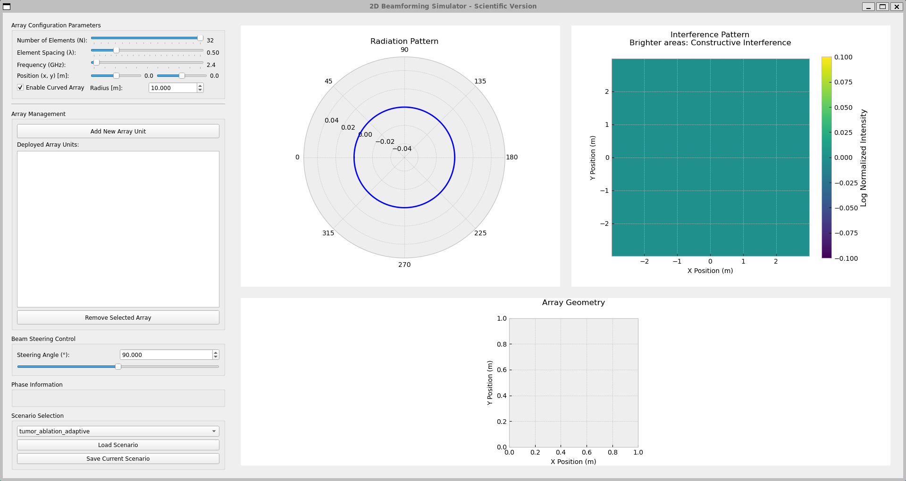
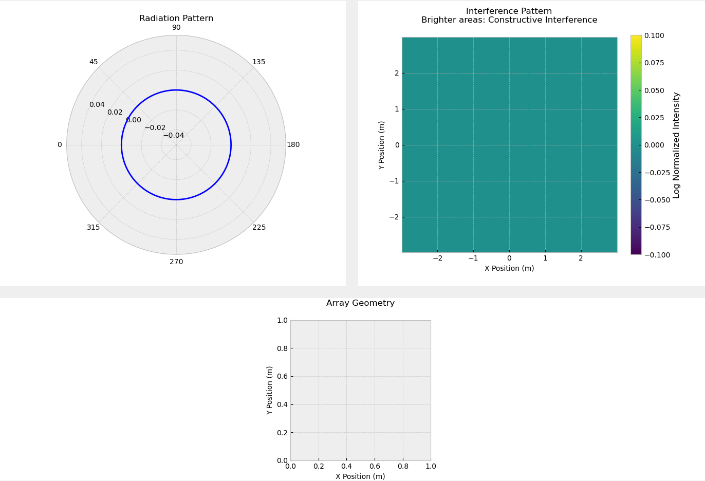
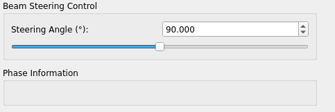
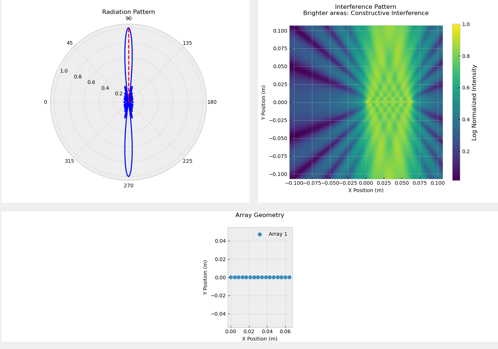
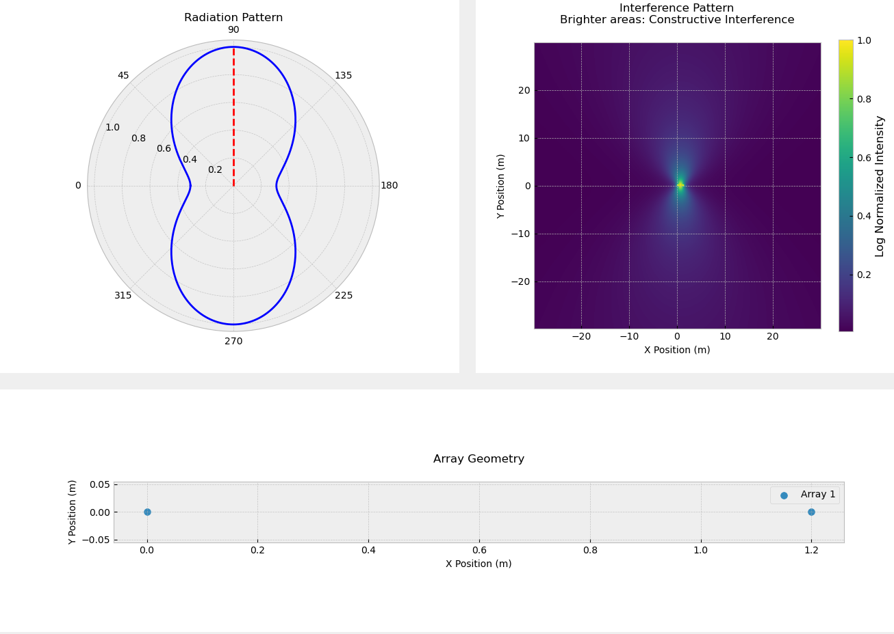

# 2D Beamforming Simulator

A comprehensive visualization tool for simulating and analyzing 2D phased array beamforming patterns in various applications including 5G communications and medical imaging.

## Features

- **Interactive Array Configuration**
  - Adjustable number of elements (2-32 elements)
  - Variable element spacing (0.1λ-2.0λ)
  - Configurable operating frequency (0.1-100 GHz)
  - Custom array positioning (X,Y coordinates)
  - Linear and curved array geometries
  - Dynamic curvature radius control

- **Real-time Visualization**
  - Polar radiation pattern plots
  - 2D interference field maps
  - Array geometry display
  - Interactive beam steering controls
  - Phase information display

- **Multi-Array Support**
  - Multiple array unit management
  - Individual array configuration
  - Combined radiation pattern visualization 
  - Cumulative interference field display

- Real-time visualization of:
  - Radiation patterns (polar plot)
  - Interference maps
  - Array geometry
  

- Dynamic beam steering:
  - -180° to +180° steering range
  - Real-time pattern updates
  - Interactive slider control
  

## Pre-configured Scenarios

### 5G Urban Small Cell
- 16 elements
- 0.4λ spacing
- 28 GHz frequency
- Linear array configuration

### Medical Ultrasound Imaging
- 128 elements
- 0.25λ spacing
- 7.5 MHz frequency

## Contributors

- [Mazen marwan](https://github.com/Mazenmarwan023)
- [Saif mohamed](https://github.com/seiftaha)
- [Mahmoud mohamed](https://github.com/mahmoudmo22)
- [Eman emad](https://github.com/alyaaa20)

We appreciate everyone's contributions to this project!

## License

This project is open-source and available under the [MIT License](LICENSE).

---
